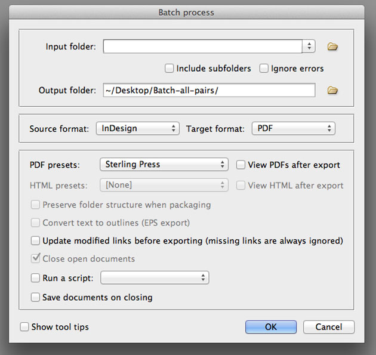
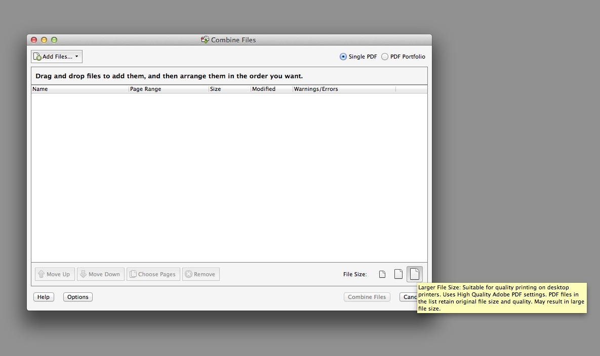
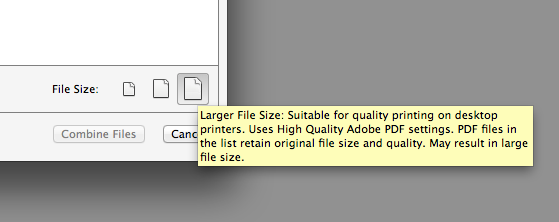
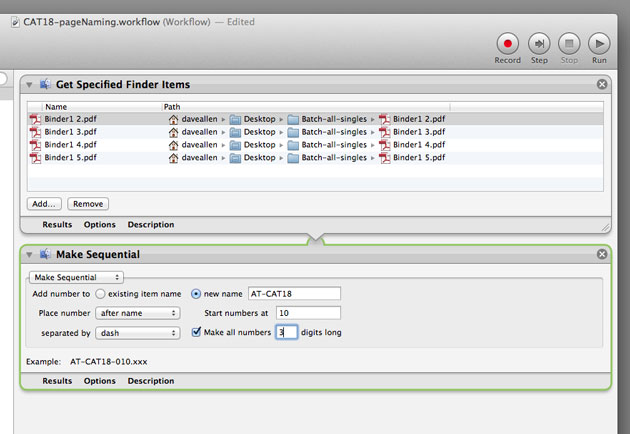

Exporting PDFs from InDesign is simple enough. Cmd + E / Ctrl + E. And it is a speedy enough process for documents with relatively few pages. But it is common practice for large-extent documents for the artwork to be packaged into a folder for each spread. I am currently working on a 488 page catalogue. My directory structure looks like this:

<figure></figure>

Manually exporting to PDF in this situation can be surprisingly time-consuming.

Let us say, conservatively, that it take 3 minutes to manually export a 2pp InDesign file. (File > Export left hand page > Name resulting PDF. Repeat for right hand page). For our 488pp catalogue this amounts to 12 hours of work. Factor in errors and each spread could take 5 minutes to process. That would require 20 hours of work.

Fortunately Peter Kahrel has written a script, batch_convert.jsxbin, which works brilliantly and includes all the sub folders in your artwork directory.

<a href="http://www.kahrel.plus.com/indesign/batch_convert.html" target="_blank">http://www.kahrel.plus.com/indesign/batch_convert.html</a>

Peter explains how to get up and running with the script so I won&#8217;t go into that here.

But there is an issue.

Printers almost always require single pages in order to ensure rapid and accurate imposition. Peter’s script produces 2pp PDF files. How can we use existing tools to work around this?

### A possible solution

This is the process I am proposing to use for the creation of 488 single page PDFs for Andy Thornton Catalogue Eighteen. I’m using InDesign CS5.5.

#### Step One

From the InDesign scripts panel, run batch_convert.jsbin, choosing the relevant Abobe PDF preset, in this case that of my print supplier, Sterling Press.
<figure></figure>

#### Step Two

In the preferences of Acrobat Pro (my version is 10.1.2) uncheck ‘Save As optimises for Fast Web View’.

Then in Acrobat go to > File > Create > ‘Combine files into Single PDF’
 

At this point care needs to be taken to select the correct file size in this dialogue box. Select Larger File Size. I believe that no compression is applied to images with this setting.

<figure></figure>

So far I haven’t been able to find a way of setting this as the default when combining pages. This step will produce a file named Binder [No.]. Save this. Remember that we changed the preferences to prevent Fast Web View being applied so don&#8217;t forget to reset this for your day-to-day PDF ceation.

#### Step Three

Open Binder [No.].pdf in Acrobat and use Tools > Extract (or select all the pages in the Pages panel) and then select Extract Pages As Separate files.

#### Step Four

You should now have all your artwork as single pages. Unfortunately with file names that don’t match the folio/page number. The good news is that Acrobat has respected the left page/right page relationship throughout the process so that it is a simple process to rename the files using Automator (if using a Mac), Adobe Bridge or any other utility.

 

#### Conclusion

There were two issues that needed resolving:

1. Are we certain that changing preferences means that Fast Web View is not applied when saving Binder[No.] at Step 2.? As far as I can tell this setting is preserved.

2. The original Sterling Press Adobe PDF preset had compatibility set at Acrobat 5 (PDF 1.5) When examining the document properties of the final files I found that the compatibility has been revised by Acrobat to Acrobat 7 (PDF 1.6). It may be that this is an issue for you.

Unless issue #2 is of significance for your workflow, then a process that could take between 12 and 20 hours could be reduced to less than an hour. Excluding proofing of course.

Thanks to the repro team at [Sterling][2] for testing my files.

 [2]: http://www.sterlingsolutions.co.uk/ "Sterling"
 
