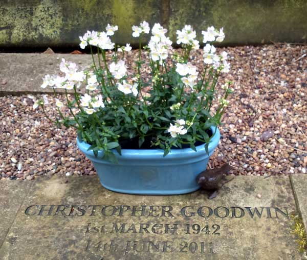

I was working from home and needed some fresh air. And some new handlebar grips for my
bike. Opening the car door let in the smell of freshly cut grass. As the day of the
week was Wednesday and the name of the town was Huddersfield, the bike shop was
closed. Which is as it should be.

Back at the car, the cut grass scent pervaded my thoughts again. It was coming from
the churchyard. The Parish Church Of St Stephen, Lindley, read the deep red notice
board. I breathed in the green perfume and stepped through the wooden arch.

Enid. May. Elsie. Henry. Names from the past. In the main part of churchyard lay the
older tenants. Very few flowers here. At the rear of the church were some plots where
the wreaths had lain untouched for so long they had an almost fossilised appearance.
Nobody left to refresh them. 

Then, round the corner, an area where the floral tributes still had colour. It was at
the sight of an imitation bird, tenderly placed next to a pale blue oval flowerpot,
that the urge to cry suddenly rose up. I suppressed it.

<figure></figure>

When I walked back onto the street I was changed. Something else will change me again tomorrow. 

What will change you?
