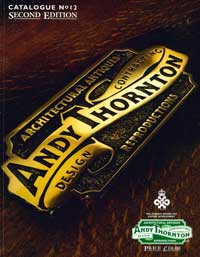
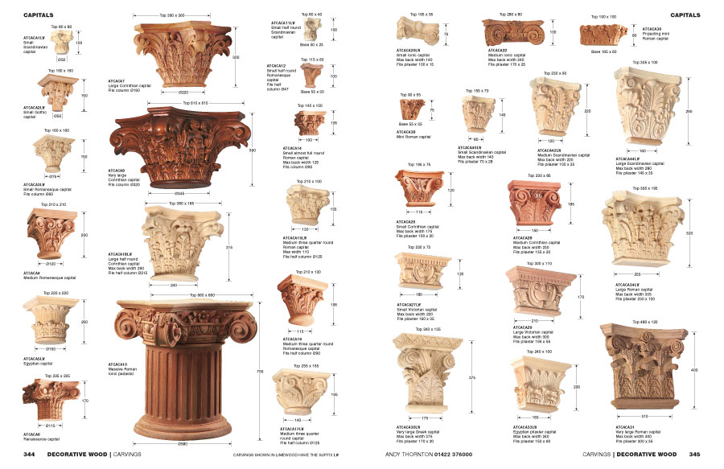
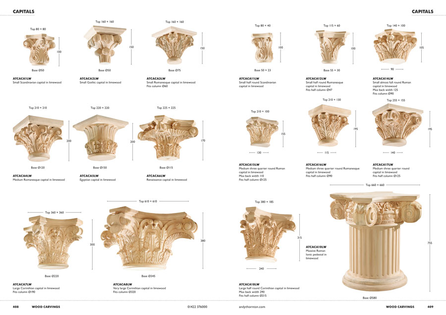
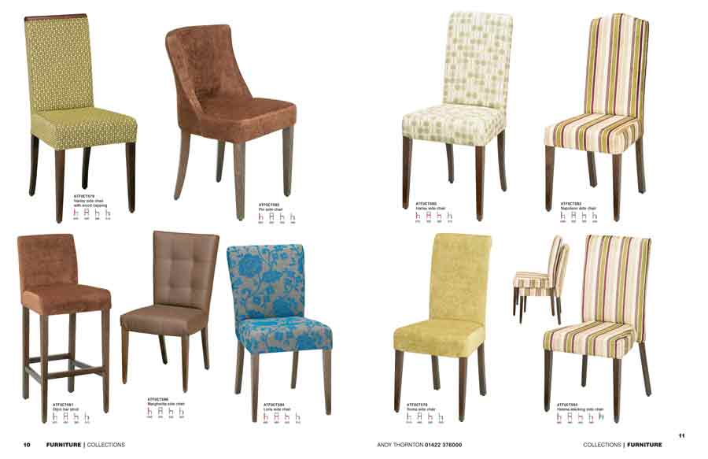
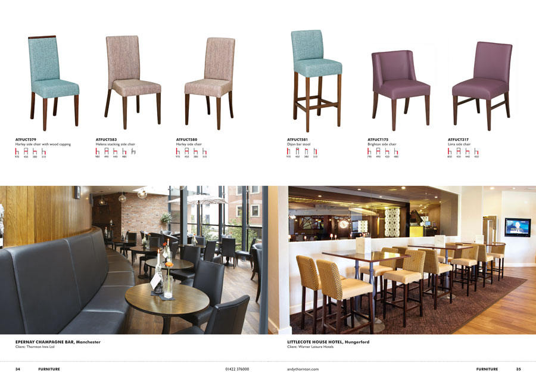
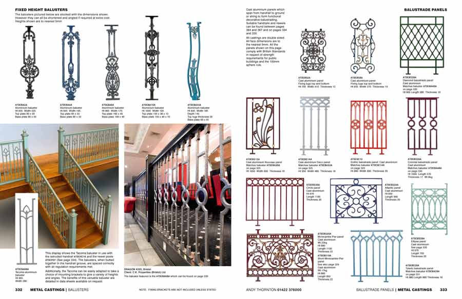
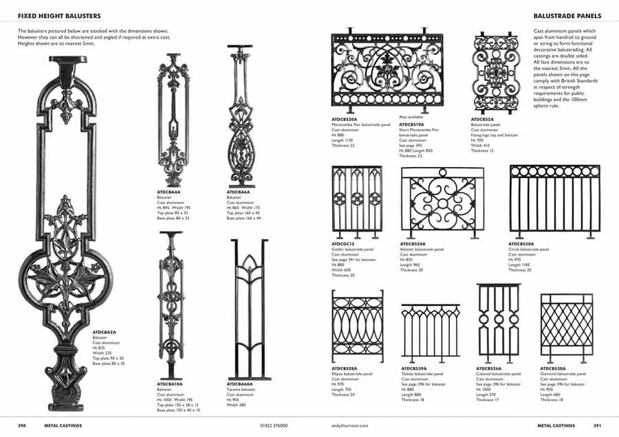
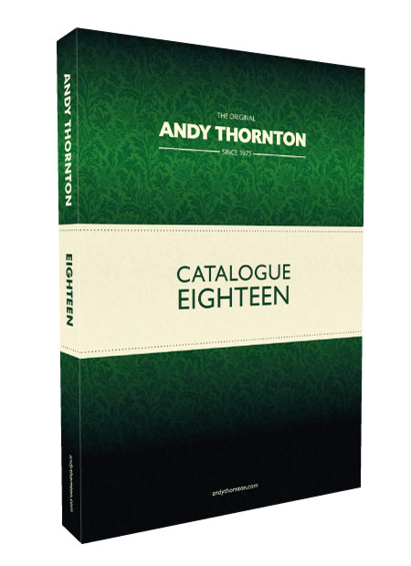

Within the hospitality industry, Andy Thornton was the first company to offer such a vast range of products and services as a one-stop shop. Contract furniture, interior lighting, metal fittings, timber carvings, stained glass, decorative castings, decor and architectural antiques could all be supplied. Until the company sold its project joinery arm in 2012, complete interiors were designed and installed all over the world. All of this had to be contained in a printed document.

<figure><figcaption>1997 Catalogue 12</figcaption></figure>
The first Andy Thornton book I worked on was Catalogue 12, which took two years to produce and was published in 1997. I sometimes find it hard to believe that there was a time when the only way to create images was on film. There were twice-daily deliveries and collections by the processing lab and whole days would be lost if the test shots were not approved.

I spent the first week in the in-house photography studio, wearing a paper protective suit, polishing brass fittings. Happy days.

But back to design matters.

Over the next few editions there were very few major changes made to the structure of the document. More content tended to be simply shoehorned into pages. As so often happens, the personality of the catalogue was lost. In fact things got a bit grey.

<figure><figcaption>Catalogue 17: A bit grey</figcaption></figure>
So for Catalogue 18, things had to change, and what had to change most was the **content**. In practice this meant:

-	Fewer products per page.
-	Production and reshooting of products to ensure consistency of appearance.
-	A review of product copy and information.

Below are some 'before and after' spreads.

<figure><figcaption>Before: Catalogue 17, Carvings</figcaption></figure>

<figure><figcaption>After: Catalogue 18, Carvings</figcaption></figure>

<figure><figcaption>Before: Catalogue 17, Furniture</figcaption></figure>

<figure><figcaption>After: Catalogue 18, Furniture</figcaption></figure>

<figure><figcaption>Before: Catalogue 17, Metal castings</figcaption></figure>

<figure><figcaption>After: Catalogue 18, Metal castings</figcaption></figure>

Pressure of time meant that internal pages had to remain fairly sparse in terms of decorative and branding elements. It was possible though to give the cover a richer feel, taking the lead from the website design. This is a trend I would like to continue for Catalogue 19, whenever that arrives.

<figure><figcaption>Catalogue 18</figcaption></figure>
