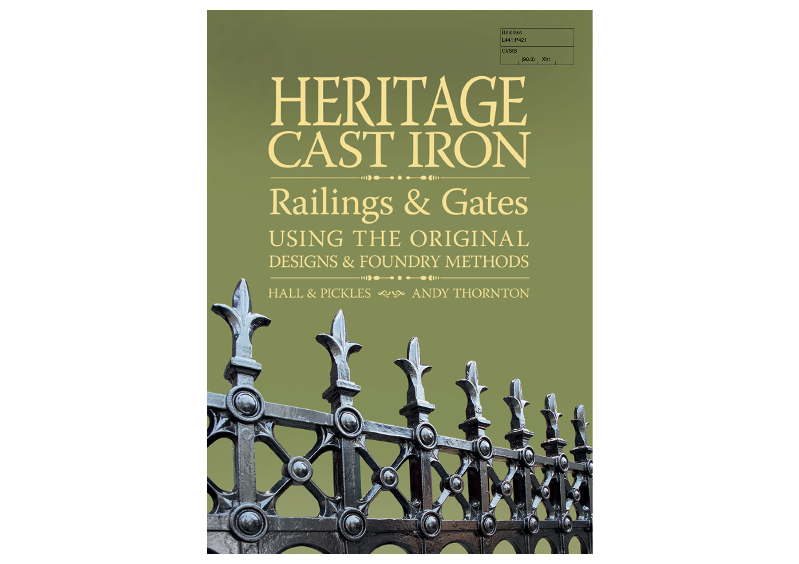
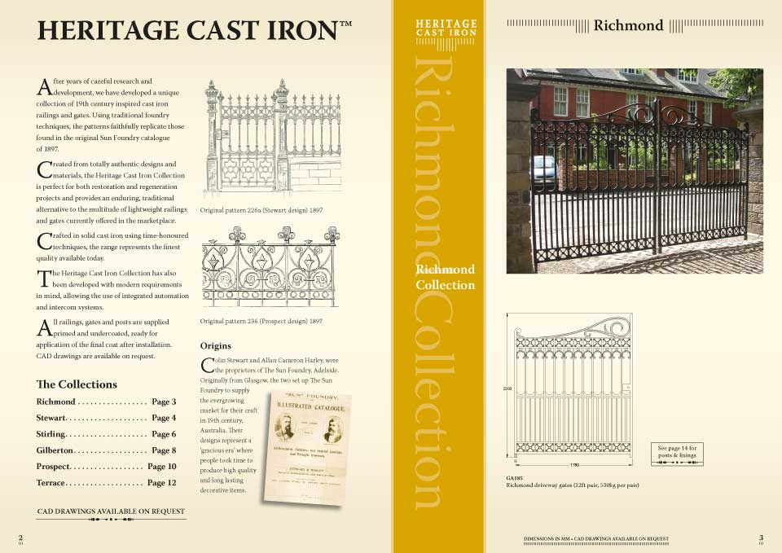
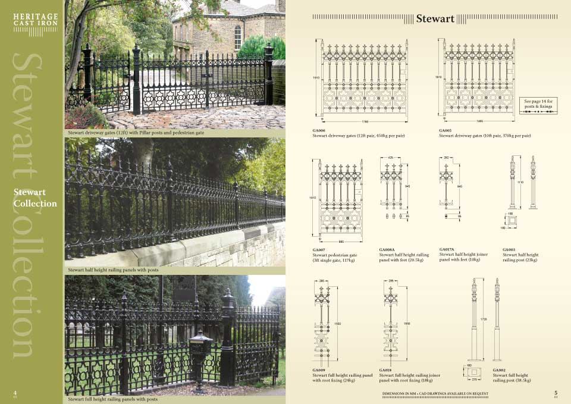
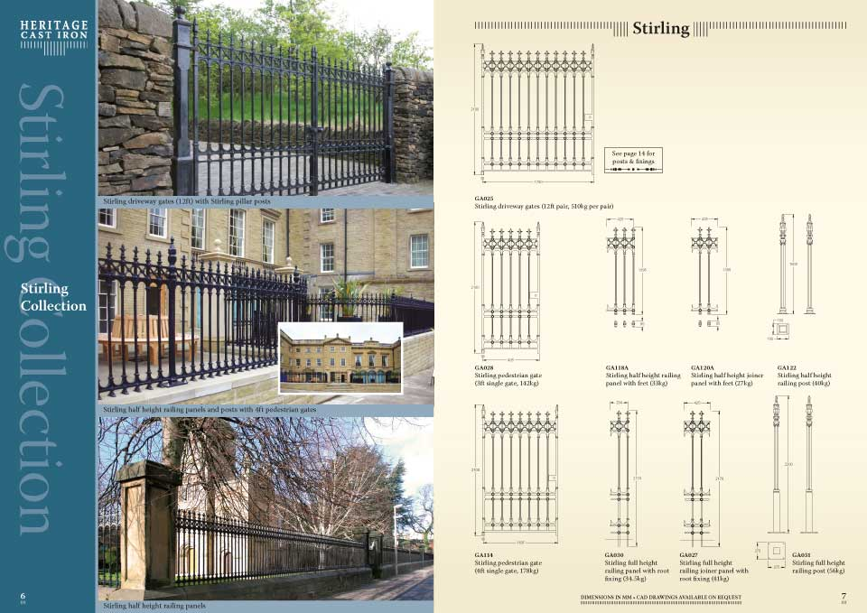
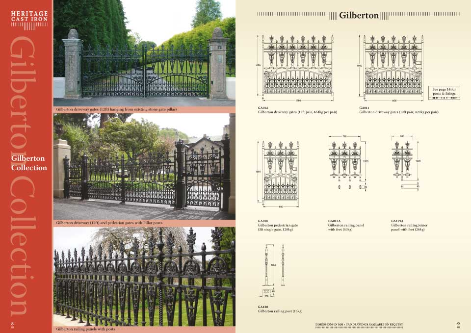

A traditional look? No problem. The shot I took for the cover came out OK, so that&#8217;s good. But there are no individual product images. What to do? Speak to the product design guys. Can they export from CAD something that Illustrator can understand? After some experimentation with different line weights and, importantly, a test proof or two from our printer, we found a solution.

<figure></figure>
<figure></figure>
<figure> </figure>
<figure> </figure>
<figure> </figure>
