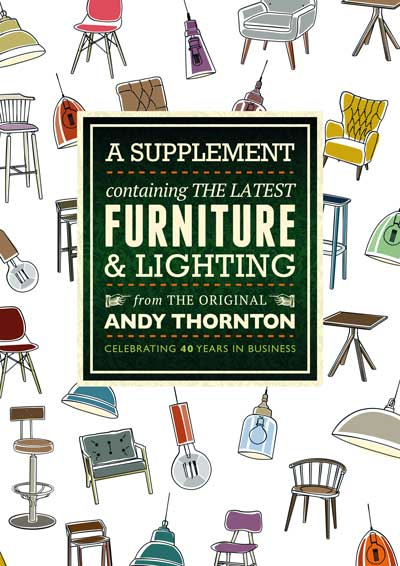
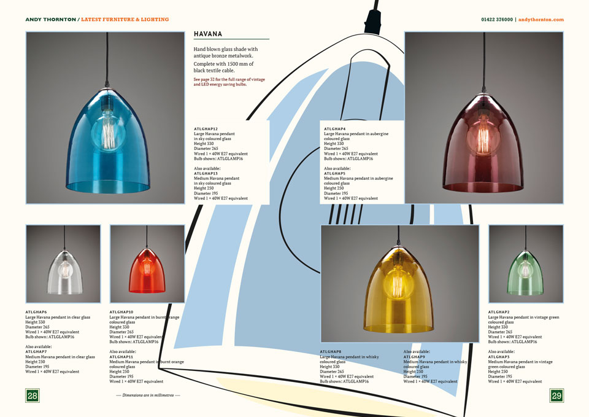
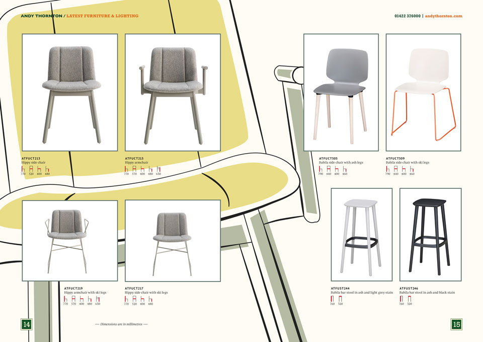
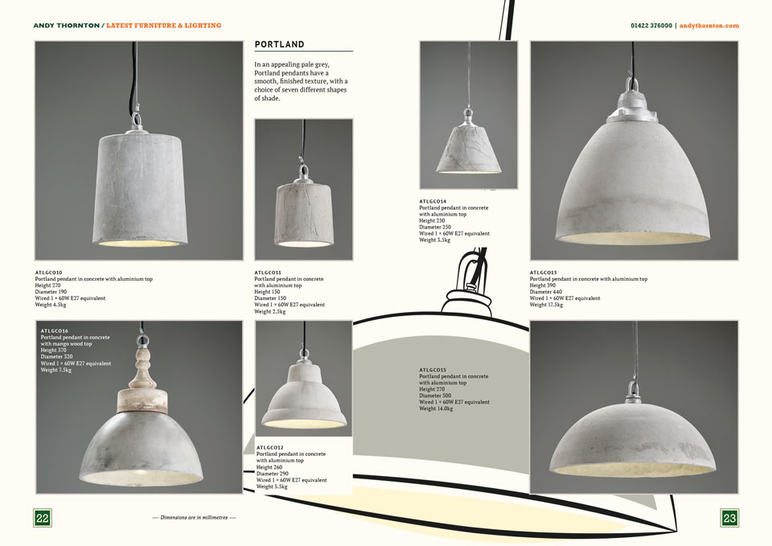
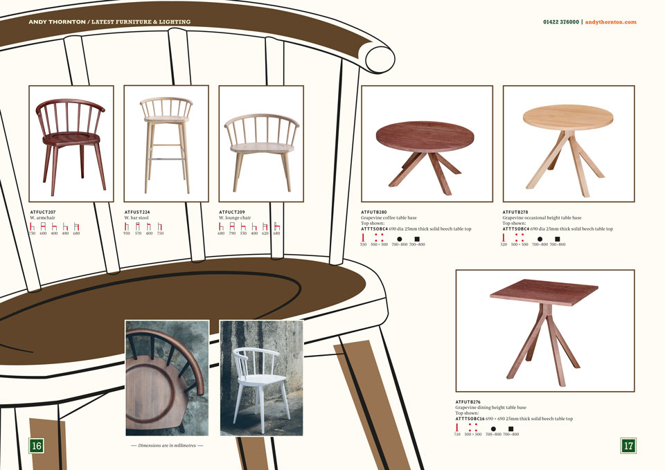

This is a document aimed at the hospitality industry containing the latest furniture and lighting from Andy Thornton Ltd. I'd long wanted to add an illustrative element to the company's identity and here was the opportunity. Illustrations allowed products to be shown on the cover but enabled a unity of appearance that prevented any single item from dominating. More difficult to achieve with photographs. Another benefit was that one or two spreads were a bit light on content. Crucially they add an element of fun, something that is often lacking in B2B market places. Another plus is they are infinitely scalable vectors and so can be used on signage and at exhibitions.

A special shout-out here to the colleague who commented "Who did the illustrations?" Well thank *you*.

<figure></figure>

<figure></figure>

<figure></figure>

<figure></figure>

<figure></figure>
