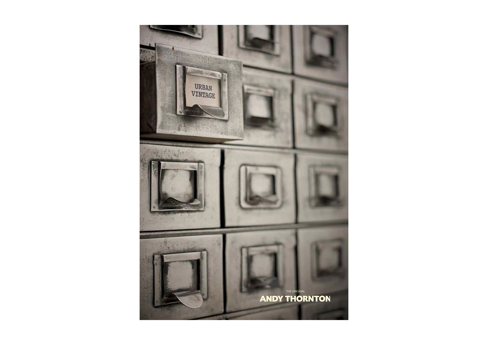
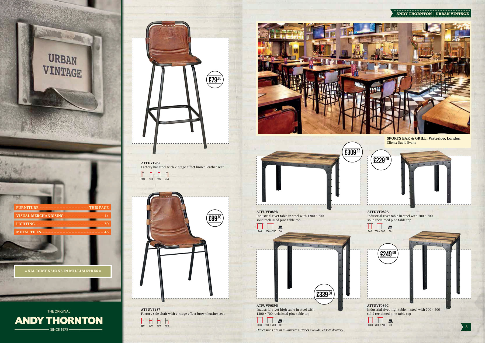
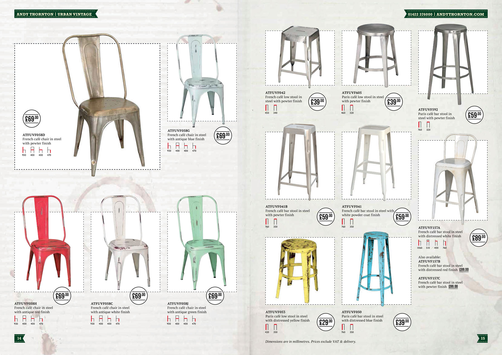
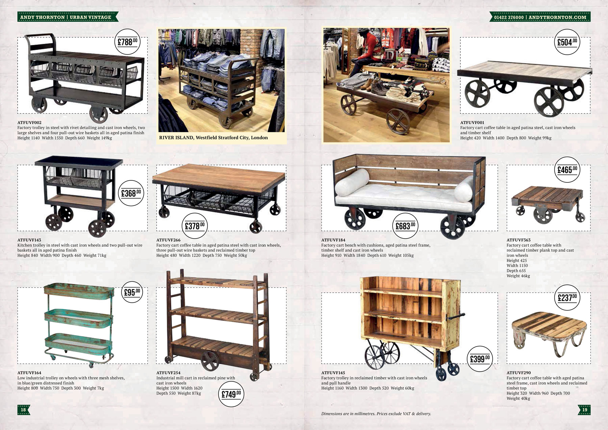
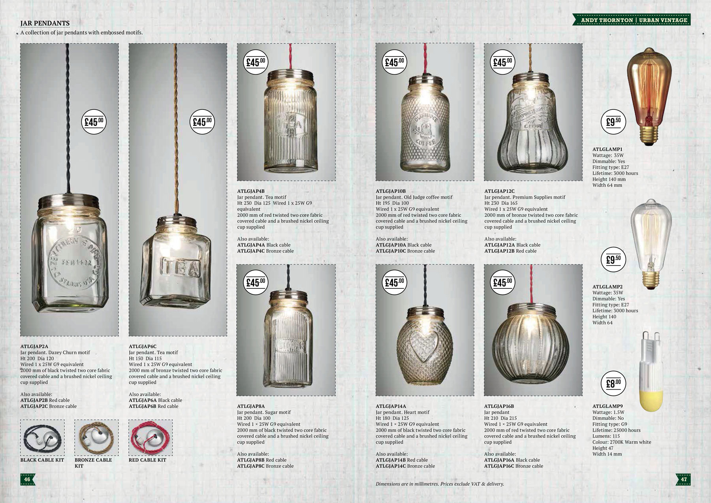

Packed full of chairs, stools, tables, decorative lighting and retail display solutions, the 52-page brochure is a must-have for all bar, pub and restaurant operators, designers and those in the business of creating shop interiors and retail display.

<figure></figure>
<figure> </figure>
<figure></figure>
<figure> </figure>
<figure> </figure>
<figure> </figure>
